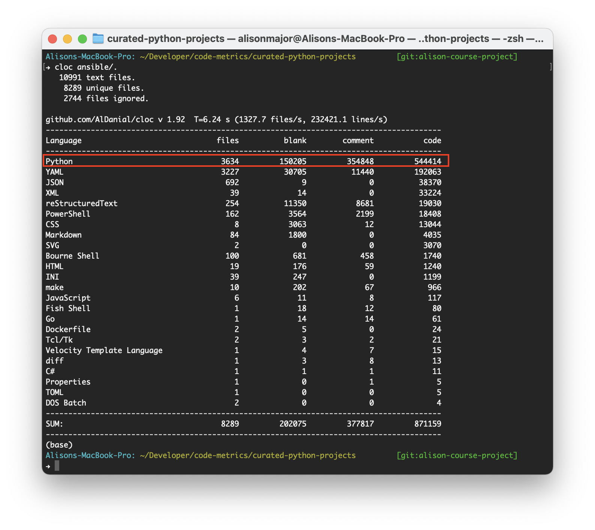

# The Impact of Structural Quality on Software Evolution

This paper will investigate how well the Pylint score (more specifically, the Refactor score) measures a system's structural quality. To do this, we will analyze the correlation between the Refactor score and the ease of adding features to the system.

Good architecture takes into account maintainability. The effort to make a feature work should be easy and localized in maintainable projects. We will measure locality by the number of files edited in a commit. We will focus on commits that represent new features rather than bug fixes.

## Goal

This paper will review how structural quality can impact software evolution.

## Contents

* [Supporting Documents](./Supporting%20Documents)
  * This folder contains articles and links that have been used for research and understanding the topic.
* [Initial Proposal](./initialproposal.pdf)
  * This is a 2-3 page paper created for the Masters Thesis course at Lewis University.
  * The proposal must be two to three pages in length.
  * It should provide a title and a detailed description of the problem you are going to solve or the topic you are going to research.
  * The proposal must give a very clear picture of what you intend to do this semester.
  * It must include a minimum of 3 references, preferably 5 references, cited using the format stated in the thesis template. The references must be cited within the body of the proposal, just as they will be in the final paper.
* Software Architecture Course
  * This course was taken prior to writing the full thesis and stood as a foundational study to scratch the surface of the topic.
  * [Paper Summary](./summary.pdf)
    * One to two page description of the paper topic including 6 to 10 references that you intend to use in your research.
  * [Course Paper](./courseproject.pdf)
    * This is a 10-12 page paper created for the Software Architecture graduate level course at Lewis University.
* Masters Thesis
  * [Thesis Paper](./masters_thesis.pdf)
  * [Thesis Presentation](./masters_thesis_slides.pdf)
    * [Presentation Slides with Notes](./masters_thesis_slides_NOTES.pdf)
    * [Note Slides Only](./masters_thesis_slides_NOTES_ONLY.pdf)

## Code

The code repository started by Dr. Omari can be found on Bitbucket at https://bitbucket.org/bankruptcy-guru/code-metrics/src/master/.

### cloc

Used to count the lines of code, [cloc](https://github.com/AlDanial/cloc) can
be easily run. Just tell it where to go!

```
cloc ansible/.
```

From there, we're specifically targeting the Python data:



## LaTeX Links

* [Masters Thesis Template](https://github.com/amajor/template-masters-thesis)
* [LaTeX Document Structure Wiki](https://en.wikibooks.org/wiki/LaTeX/Document_Structure)
* [Overleaf Guides](https://www.overleaf.com/learn)
